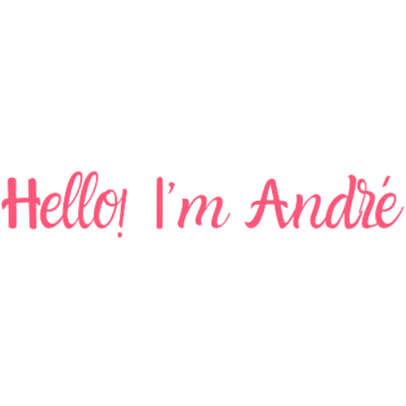

 

Technical Trainee in Internet Computing

**About me**

- 🔭 Currently, I am working and studying at IFRN [IFRN/CA](https://github.com/Andremdrs77/Estudos-IF)

- 🌱 Learning **JavaScript, GitHub (advanced).**

- 💬 Talk with me about **back-end**

- 📫 To contact me, email **andre1998vv@gmail.com**

- 🇧🇷 Brazilian, but with average english

|  |  |
| ------------- | ------------- |

#### Top Repositories

